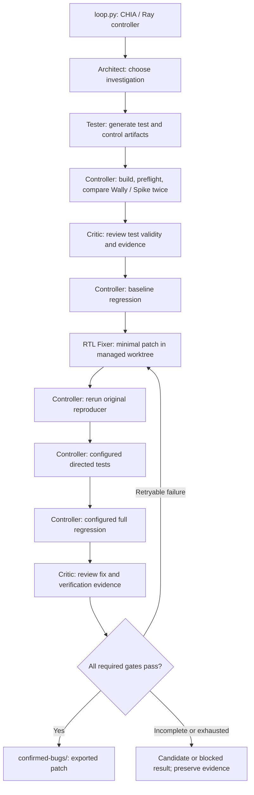

# WallyGuard

WallyGuard uses CHIA agents to investigate CORE-V Wally, generate RISC-V tests,
compare Wally against Spike, and propose small RTL repairs. The Python controller
owns reproduction, verification, artifact integrity, and final patch promotion.
An LLM's bug claim or approval is never sufficient to confirm a hardware bug.

This README describes the implementation in [loop.py](loop.py). See
[ORCHESTRATION.md](ORCHESTRATION.md) for the reproducer contract, validation rules,
recovery mechanisms, and implementation details.

## High-level architecture

**The Architect, Tester, Critic, and RTL Fixer are LLM agents.** The controller
is ordinary Python code in `loop.py` and `orchestration/`, not an LLM. It runs
deterministic verification and enforces confirmation gates; agent claims cannot
override those results. Workers and MCP servers are execution infrastructure,
not additional LLM agents.



The diagram shows the successful path and repair feedback. A baseline match,
invalid test, rejected review, or infrastructure failure can end an attempt
earlier; an agent cannot bypass the deterministic gates.

| Component | Type | Responsibility |
| --- | --- | --- |
| Controller | Non-LLM: Python orchestration | Schedules stages, freezes test inputs, classifies results, records state, and exports patches. |
| Architect | LLM agent | Inspects RTL, ISA documentation, and prior attempts to select a target. |
| Tester | LLM agent | Creates a candidate test, positive control, build artifacts, and a structured reproducer. |
| Critic | LLM agent | Reviews baseline evidence and later the proposed fix; can request revision or reject. |
| RTL Fixer | LLM agent | Localizes the issue and edits permitted RTL in the managed checkout. |
| CVW worker (`wally_sim`) | Non-LLM: execution infrastructure | Hosts the checkout, MCP shell tools, builds, Wally/Spike execution, and artifacts. |
| OpenCode worker (`opencode_creds`) | Non-LLM: model-call infrastructure | Runs model calls through CHIA's OpenCode integration. |

The supplied cluster places both worker types on the configured head host. The
OpenCode worker runs in Docker; the CVW worker sources the host's Wally toolchain.
Model calls reach the CVW worker through a managed MCP tool server. The project
wrapper adds readiness checks, bounded command execution, and shutdown handling.

### How an iteration works

1. **Prepare an isolated baseline.** The controller creates or reuses
   `wally-worktrees/wally-shared`, records its baseline commit/tree and ownership,
   and loads previous attempt summaries.
2. **Generate and validate a test.** The Architect selects an investigation and
   the Tester supplies artifacts. Preflight checks the build, positive control,
   oracle completion, required evidence, and declared trap-vector alignment.
3. **Reproduce deterministically.** The controller invokes Wally and Spike on the
   same ELF and compares their evidence. A mismatch must repeat at least twice
   with the same failure fingerprint. A watchdog or nonzero exit alone is not
   proof of a bug.
4. **Review the baseline.** The Critic may approve, reject, or request test
   repairs. With regression enabled, the controller also runs the baseline
   regression. An infrastructure failure blocks repair; a recognized baseline
   RTL failure can become evidence for the Fixer.
5. **Repair and verify.** The Fixer changes RTL while original test inputs remain
   frozen. The controller rebuilds/reruns the reproducer, then runs the configured
   directed command and full regression. The Critic reviews the diff and results.
6. **Promote or retry.** Only passing deterministic gates plus the required
   reviews permit `confirmed`. Failed verification returns evidence to the
   bounded fix loop. Unresolved failures retain artifacts and can stop discovery.

A targeted fix with regression disabled or directed tests unconfigured is only
`candidate_fix_verified`, exported to `candidate-bugs/`. It is not fully verified.
The final confirmation gate is checked again when exporting to `confirmed-bugs/`.
Historical patches may predate these gates; inspect their associated run records.

### Faster iterations, same verification gates

Each new run includes a native self-check harness, a build script, and a
`reproducer.json` contract. The Tester adapts the RV64 starter to the target and
calls `validate_reproducer` to catch contract mistakes during its conversation.
Tester shell commands start in the run directory; relative helper scripts stay
with the test artifacts. Use `$WALLY` for repository paths and `$WALLY_TEST_DIR`
for run artifacts. Other roles continue to start at the checkout root.
The assembly example deliberately fails compilation until real assertions are
added. The controller repeats preflight and independently executes the tests;
an agent tool's `PREFLIGHT_READY` is never evidence of a hardware bug.

Command status calls wait up to 30 seconds for completion instead of making the
model repeatedly poll. Shell tools default to a 120-second deadline; agents can
request a longer `timeout_seconds` for builds, capped by `WALLY_REGRESSION_TIMEOUT`.
Controller Spike runs have a separate 60-second deadline, configurable with
`WALLY_ORACLE_TIMEOUT`, without shortening the build or Wally simulation deadline.

The Architect receives a compact index of the last 40 attempts including observed
failure reasons and baseline revisions, plus brief recent agent notes explicitly
marked unverified. The Tester also receives recent failure reasons. It saves its
contract to `reproducer.json` and returns `reproducer_file="reproducer.json"`, so
it need not regenerate a large contract in its answer. The controller reads that
file and applies the same validation and evidence gates. Legacy inline contracts
remain accepted. File checks prune generated build/log trees before traversal.
Full history and evidence remain available on disk. Unresolved merge
conflicts block a campaign before agents start.

Every run records stage durations and prompt-context sizes in `attempt.json`.
Tool counts and command durations live in `controller/agent-*/tool-metrics.json`.
The cumulative exploration ledger (`runs/coverage.json`) distinguishes selected
targets from controller-tested and reproduced cases. The Architect receives a
bounded summary and advisory handoff reminders after 12 commands or eight minutes;
it may explain and continue an essential investigation. No agent deadline is reduced.
Architect and Tester context also includes bounded prior Critic rejections and
revision requests. A review recovered from a guard-failed stage is explicitly
unaccepted advice; it never changes verification or patch-promotion gates.
Controller lifecycle timing is written under `logs/lifecycle-events.jsonl`, so
it does not modify guarded input files during a review. Independent reproducer
execution supplies the same absolute `WALLY_TEST_DIR` as the agent shell.
New timing includes worker/dispatch overhead, model capacity waits, OpenCode
run/export, command lifecycle, retries and verifier steps. Unavailable pure model
generation time and separate RTL compile/simulation time are reported as null.
See [the measured performance audit](docs/performance-audit.md) for bottlenecks,
changes, safety checks and the limits of the available before/after comparison.
Inspect a run with:

```bash
python -m orchestration.performance runs/<iteration-tag>
python -m orchestration.performance runs/<iteration-tag> --json
```

Chia profiling is enabled for the CLI by default. It records task timing and
dependencies under Chia's default `/tmp/ray/<job-id>` directory on the driver
host; use `WALLY_PROFILE_DIR` for persistent storage and `chia viz-profile` for
the timeline. Set `WALLY_PROFILE=0` to disable it. None of these changes reduces
the required baseline repetitions, skips controller verification, or reuses a
previous hardware verdict. Measure comparable completed runs before claiming an
end-to-end speedup.

## Repository structure

```text
WallyGuard2/
├── README.md                  Setup and architecture
├── ORCHESTRATION.md           Detailed verifier and orchestration contracts
├── GOOGLE_GENAI.md            Historical deployment/authentication notes
├── loop.py                   Four-agent campaign and verification sequencing
├── cluster.yaml              CHIA head, CVW worker, and OpenCode worker settings
├── recover_workspace.py      Interrupted-job ownership/archive recovery helper
├── merge-open-prs.sh          Separate CVW maintenance helper; not part of the loop
├── orchestration/
│   ├── agent_protocol.py     Agent schemas, JSON extraction, format-only repair
│   ├── artifact_guard.py     Stage allowlists, snapshots, unauthorized-edit recovery
│   ├── event_log.py          Redacted JSONL events and logger configuration
│   ├── processes.py          Command deadlines, disk logs, process-tree cleanup
│   ├── result_classifier.py  Semantic outcomes and reproducer command validation
│   ├── retry_policy.py       API error classification and bounded backoff
│   ├── stage_runner.py       Same-stage MCP recovery
│   ├── test_preflight.py     Builds, controls, oracle comparison, evidence capture
│   ├── tool_runtime.py       Managed MCP tools and diagnostic OpenCode wrapper
│   └── verification_state.py Final confirmation predicates
├── tests/
│   ├── test_orchestration.py Unit tests for validation and recovery mechanisms
│   └── test_loop_integration.py Mocked campaign/state-transition tests
├── cvw/                      Separately populated Wally checkout (ignored)
├── wally-worktrees/          Managed checkout and ownership metadata (generated)
├── runs/                     Per-iteration inputs, logs, evidence, and state
├── candidate-bugs/           Partially verified patch exports (generated)
└── confirmed-bugs/           Patches accepted by the full confirmation gate
```

`cvw/` is not supplied by a WallyGuard package installation. Keep a populated CVW
Git checkout and its dependencies on the simulation host. Generated directories
are placed beside `WALLY_PATH`, so changing that path also changes their location.
`merge-open-prs.sh` merges upstream PRs into CVW and is not a setup or run step.

## Setup

### 1. Python and CHIA

The local CHIA installation documents Python **3.10.19**, matching its worker
images. On a fresh host, with a CHIA source checkout available:

```bash
conda create -n chia_env python=3.10.19
conda activate chia_env
python -m pip install -e /path/to/chia
```

For the existing deployment:

```bash
source "$HOME/miniconda3/etc/profile.d/conda.sh"
conda activate chia_env
cd "$HOME/miniconda3/WallyGuard2"
```

This repository has no Python packaging manifest or root Makefile. Run from the
repository root. The job submission below uploads `loop.py` and `orchestration/`
through Ray's working-directory runtime environment; it does not install CHIA,
EDA tools, or credentials on a fresh machine.

### 2. Wally and regression prerequisites

Use the intended CVW revision, with initialized dependencies and no unresolved
Git merges. Follow that checkout's `README.md` and official toolchain installation
scripts for the RISC-V compiler, Spike, Verilator, `uv`, and any simulator/license
requirements of the selected regression.

From the WallyGuard repository root, activate the installed toolchain:

```bash
export WALLY_PATH="$(pwd)/cvw"
source "$WALLY_PATH/setup.sh"
export WALLY_SPIKE="$HOME/riscv/bin/spike"
"$WALLY_SPIKE" --help 2>&1 | head -n 3
git -C "$WALLY_PATH" status --short
command -v spike verilator uv
```

For an already installed toolchain, CVW's documented test preparation and baseline
regression commands are:

```bash
(
    cd "$WALLY_PATH"
    git submodule update --init --recursive
    make --jobs
    bin/regression-wally
)
```

Run preparation before the first campaign. The current CVW Makefile includes
architectural tests, RISCOF tests, peripheral tests, floating-point vectors,
coverage tests, and other generated inputs. Optional regression modes can require
additional inputs such as Linux/Buildroot or commercial tools; `make` alone is not
a guarantee that every optional suite is ready. Inspect the selected checkout's
`bin/regression-wally --help` and suite documentation.

The loop's **test preflight** validates generated reproducers. It does **not**
automatically install missing full-regression prerequisites. Baseline regression
infrastructure failures produce `regression_blocked`, not confirmation.

### 3. Model credentials

The current Architect, Tester, and Critic defaults use Vertex AI through OpenCode.
Set your project and configure Application Default Credentials on the host:

```bash
export GOOGLE_CLOUD_PROJECT="your-project-id"
gcloud auth application-default login
gcloud auth application-default set-quota-project "$GOOGLE_CLOUD_PROJECT"
```

The cluster mounts `$HOME/.config/gcloud` read-only at
`/home/ray/.config/gcloud` in the OpenCode container. Its user must be able to read
those credentials, and the project must have access to the configured models.
The Fixer uses a separate OpenCode model; ensure that provider is available too.
Do not put credential contents into runtime-environment JSON or repository files.

If Gemini reports `Requests ending with a model turn are not supported.`, the
OpenCode wrapper makes one continuation attempt in the same session, preserving
the model, tools and assignment. It adds a user turn rather than restarting the
investigation. Only this exact HTTP 400 is eligible; other errors or a repeated
failure still stop the stage. Original error diagnostics and the recovery count
are retained. This compatibility workaround is unit-tested; end-to-end recovery
has not yet been demonstrated on the deployed provider.

[GOOGLE_GENAI.md](GOOGLE_GENAI.md) contains deployment-specific ADC permission
notes. Its older model defaults, submission helpers, and recovery descriptions
may differ from current code; use this README and `loop.py` for current behavior.

### 4. Start and check the cluster

The supplied [cluster.yaml](cluster.yaml) assumes Miniconda at
`/home/${USER}/miniconda3`, the `chia_env` environment, and CVW at
`/home/${USER}/miniconda3/WallyGuard2/cvw`. Check these paths on a different host.
The SSH key must already authorize access to the head host, and Docker must be
available. `GCP_PRIVATE_KEY_PATH` is the configuration's SSH-key variable; the
file does not provision a new GCP machine.

```bash
export HEAD_IP="$(hostname -I | awk '{print $1}')"
export GCP_PRIVATE_KEY_PATH="$HOME/.ssh/chia_gcp"
# GOOGLE_CLOUD_PROJECT must also be exported before cluster creation.
chia up cluster.yaml -y
curl --fail --silent --show-error http://127.0.0.1:8265/ >/dev/null
```

On hosts with multiple interfaces, set `HEAD_IP` to the address reachable by the
workers. Use the dashboard on the head host, or through your existing tunnel.
Verify worker resources from the activated environment:

```bash
python -B - <<'CHECK_CLUSTER'
import ray
ray.init(address="auto")
resources = ray.cluster_resources()
print(resources)
assert resources.get("wally_sim", 0) >= 1, "CVW worker is missing"
assert resources.get("opencode_creds", 0) >= 1, "OpenCode worker is missing"
ray.shutdown()
CHECK_CLUSTER
```

The configured OpenCode worker advertises three credential resource units; the
loop additionally defaults to one concurrent LLM call. Dashboard reachability
and resource registration do not prove model authentication or toolchain health.
Cluster start commands include `ray stop`; start/recreate it only when existing
jobs can be interrupted. This repository uses `chia up`, not `make cluster`.

## Run the full configured loop

Run these commands from the repository root after setup and cluster checks.
Select directed tests relevant to the investigation; `arch64i` below is an
example requiring its architectural-test assets.

```bash
export WALLY_PATH="$(pwd)/cvw"
export WALLY_RUN_REGRESSION=1
export WALLY_DIRECTED_COMMAND="bin/wsim rv64gc arch64i --sim verilator"
export WALLY_REGRESSION_COMMAND="bin/regression-wally"
export WALLY_REGRESSION_TIMEOUT=5400
export WALLY_REPRODUCER_TIMEOUT=900
export WALLY_LLM_CONCURRENCY=1

# Forward supported configuration and verify the uploaded controller sources.
python -B -m orchestration.submission --address http://127.0.0.1:8265
```

The hardware checkout stays on the CVW host; only orchestration code is uploaded.
`WALLY_PATH` and optional `WALLY_ISA_DOCS` must resolve on that host. Changes to
local code require a new submission to reach workers. The submission helper prints
an SHA256 digest covering `loop.py`, orchestration Python sources, and harness
templates. The uploaded entrypoint checks that digest before starting the loop;
a stale or incomplete package fails before touching the worktree. Successful
checks print `Controller source verified` and save `controller_sha256` in each
attempt. Use `python -B -m orchestration.submission --dry-run` to inspect the
submission without starting a job. Direct `python loop.py` submissions bypass
this check. Existing jobs retain the code they were submitted with.

Provider `429 / Resource exhausted` failures are separate from controller or
simulation failures. The console reports the model, attempt count and next retry
delay, or that retries have stopped. The existing bounded backoff remains in
place. Persistent provider capacity failures preserve the attempt and stop the
campaign; they cannot establish or refute an RTL bug. See the measured breakdown
in [the performance audit](docs/performance-audit.md).

While an agent runs, `AGENT_PROGRESS` reports elapsed seconds, commands started
and commands still running at most once per minute. Successful HTTP health-check
lines are suppressed; failures still surface. Increasing command counts indicate
tool activity. An unchanged count does not distinguish model reasoning from
provider/CLI waiting, and server health alone does not establish agent progress.

`loop.py` defaults to **200 discovery iterations**, with up to **3 fix attempts**
and **2 test-repair rounds** per candidate. It has no command-line argument parser.
For a different campaign size, a Python entrypoint can call
`loop.main(max_iterations=1, max_fix_attempts=3)` and propagate its return code.
A successful job exit alone does not mean a bug was found or a patch confirmed;
read the attempt status and verification evidence.

### Configuration

Environment settings are read when `loop.py` is imported.

| Variable | Default | Purpose |
| --- | --- | --- |
| `WALLY_PATH` | `/home/rafay/miniconda3/WallyGuard2/cvw` | Original CVW checkout on the simulation host; override for other installations. |
| `WALLY_SPIKE` | Toolchain discovery | Absolute RISC-V Spike path on the simulation host. Otherwise searches `$RISCV/bin`, `~/riscv/bin`, `/opt/riscv/bin`, then PATH. Identity is checked before agents run. `/usr/bin/spike` can be an unrelated secrets CLI. |
| `WALLY_RUN_REGRESSION` | `0` (disabled) | Set to `1` to enable baseline and patched full regression, as in the full-loop example above. |
| `WALLY_DIRECTED_COMMAND` | Empty | Operator-selected related tests; required for full confirmation. |
| `WALLY_REGRESSION_COMMAND` | `bin/regression-wally` | Operator-selected full regression command. |
| `WALLY_REPRODUCER_TIMEOUT` | `900` | Deadline in seconds for each reproducer build/simulator command. |
| `WALLY_ORACLE_TIMEOUT` | `60` | Controller Spike deadline, capped by the reproducer timeout. Increase for deliberately long test programs. |
| `WALLY_COMMAND_TIMEOUT` | `120` | Default agent shell-command deadline. A tool call can request a longer `timeout_seconds`, up to the regression timeout. |
| `WALLY_REGRESSION_TIMEOUT` | `5400` | Deadline in seconds for each directed/full regression command. |
| `WALLY_AGENT_TIMEOUT` | `14400` | Deadline in seconds for an LLM call. |
| `WALLY_BASELINE_RUNS` | `2` | Baseline repetitions; values below two are raised to two. |
| `WALLY_LLM_CONCURRENCY` | `1` | Global LLM capacity; an existing named Ray capacity actor retains its initial limit. |
| `WALLY_PROFILE` | `1` | Enable Chia task profiling when running `loop.py` as the CLI. |
| `WALLY_PROFILE_DIR` | Chia default | Profile output directory on the driver host; use a persistent path to retain timelines. |
| `WALLY_ISA_DOCS` | Empty | Optional local ISA documentation path supplied to agents. |
| `GOOGLE_CLOUD_PROJECT` | Deployment-specific fallback in `loop.py` | Set explicitly for your Vertex project; provider location is `global`. |

| Agent | Model default in source | Override |
| --- | --- | --- |
| Architect | `google-vertex/gemini-3.8-flash` | `CHIA_ARCHITECT_MODEL` |
| Tester | `google-vertex/gemini-3.1-pro-preview-customtools` | `CHIA_TESTER_MODEL` |
| Critic | `google-vertex/gemini-3.8-flash` | `CHIA_CRITIC_MODEL` |
| RTL Fixer | `opencode/mimo-v2.5-free` | `MODELS["rtl_fixer"]` in `loop.py`; no environment override. |

These are configured identifiers, not a guarantee of current provider access.
Changing providers may also require updating the registered provider definition
and credentials; the loop does not silently fall back to another model.

## Results, safety, and recovery

Each iteration writes to `runs/<UTC-timestamp>-<id>/` beside the original checkout:

- `attempt.json`: stage results, reviews, models, fix attempts, and final status.
- `proposed.patch`: the archived working diff.
- `build/` and `logs/`: generated binaries, simulator/build output, baseline and
  patched verification records, and preserved comparison evidence.
- `events.jsonl` and stage event files: structured semantic outcomes with raw exit
  codes retained as diagnostic fields.
- `controller/`: frozen inputs, artifact-guard snapshots, raw/parsed agent answers,
  format-repair responses, validation errors, and CLI diagnostics.

The original CVW checkout is not the agent editing workspace. The first managed
copy can capture local source edits in a private baseline commit; subsequent
iterations restore that baseline while retaining ignored dependency/build data.
Changes to the original checkout are not automatically synchronized. Confirmed
patches are exported, not automatically applied or accumulated into that baseline.
Do not run unrelated editors or campaigns in the managed shared checkout.

| Status | Meaning |
| --- | --- |
| `confirmed` | Repeated baseline mismatch, required reviews, targeted fix, directed tests, and configured full regression passed. |
| `candidate_fix_verified` | Targeted fix passed and was reviewed, but full verification requirements were not all enabled/configured. |
| `baseline_not_reproduced` / `baseline_not_reproducible` | No accepted repeatable mismatch; no confirmation. |
| `regression_blocked` | Baseline regression could not establish usable results because of infrastructure or an unclassified failure. |
| `fix_attempts_exhausted` / `fix_rejected` | Repair was not accepted; evidence is retained. |
| `agent_output_invalid` / `invalid_artifacts` | Output contract or artifact integrity validation failed. |
| `api_rate_limit` / `mcp_server_timeout` | Bounded service recovery exhausted; not evidence of a hardware bug. |

Rate limits retry the same stage/workspace with bounded backoff. A hung MCP server
can be restarted once. JSON schema failures get one tool-free format-repair retry.
Unauthorized edits are archived and restored. Command timeouts preserve disk logs
and trigger process-tree cleanup.

Current limitations to account for when operating the loop:

- There is no dedicated command to retry only blocked verification on an unchanged
  patch. Post-patch regression failures currently return through the Fixer loop,
  including infrastructure failures; inspect evidence before restarting a campaign.
- There is no separate mandatory stress/RISC-V-DV stage or general automatic test
  minimizer. Confirmation covers the configured directed and regression commands.
- `recover_workspace.py` checks stopped/failed job ownership and archives an
  interrupted attempt; it is not stage-level resume. It predates the newer
  `active` attempt flag and may leave that flag set, so review ownership metadata
  before reuse. Do not clear active-workspace protection while a job is running.
- Artifact guards enforce allowed workspace changes, but are not an operating
  system sandbox for hostile shell commands.

## Tests

Run the offline unit and mocked integration tests from the activated CHIA
environment:

```bash
python -B -m unittest discover -s tests -p 'test_*.py' -v
```

The tests cover structured output and format repair, reproducer classification,
command masking, controls and vector alignment, artifact isolation, timeout
cleanup, API/MCP recovery, event logging, and confirmation gates. The mocked
integration tests exercise agent sequencing through verification and patch export
without GCP, Vertex, Spike, or a real Wally build. They validate orchestration;
a live hardware campaign is still required to validate a particular RTL fix.
