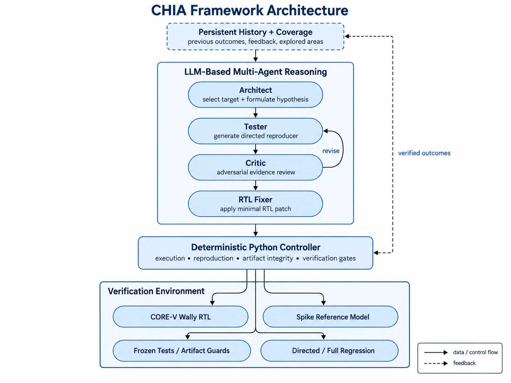

# WallyGuard

WallyGuard uses CHIA agents to investigate CORE-V Wally, generate RISC-V tests,
compare Wally against Spike, and propose small RTL repairs. The Python controller
owns reproduction, verification, artifact integrity, and final patch promotion.
An LLM's bug claim or approval is never sufficient to confirm a hardware bug.

This README describes the implementation in [loop.py](loop.py). See
[ORCHESTRATION.md](ORCHESTRATION.md) for the reproducer contract, validation rules,
recovery mechanisms, and implementation details.

## Prerequisites

WallyGuard does **not** install CHIA, CORE-V Wally, or the RISC-V toolchain.
Cloning this repository alone is not enough to run a hardware experiment.
Before starting the loop, provide:

1. CHIA installed and working in a Python/Conda environment, including its Ray CLI.
2. A complete CORE-V Wally (CVW) Git checkout with CVW's required submodules and dependencies.
3. CVW's normal installation and environment setup completed successfully.
4. A RISC-V cross compiler, binutils, and the other toolchain components required by CVW.
5. The RISC-V Spike ISA simulator, available through `WALLY_SPIKE` or toolchain discovery.
6. Verilator and CVW's normal build/simulation dependencies and test assets.
7. Working Google Cloud Application Default Credentials (ADC), a billing-enabled
   Vertex AI project, and access to the configured models when using the supplied Gemini configuration.
8. CHIA's OpenCode integration and its worker image, plus Docker and SSH access
   required by the supplied cluster configuration.

The WallyGuard artifact contains the complete CHIA loop, multi-agent workflow,
deterministic verification controller, orchestration/recovery code, tests,
configuration, and documentation. CORE-V Wally and its RISC-V simulation/toolchain
environment are external prerequisites.

First verify that **CVW itself can build and run its normal simulation tests**
using its own installation instructions, before attempting WallyGuard. The
[CHIA documentation](https://docs.chialoops.ai/en/latest/) and
[CORE-V Wally repository](https://github.com/openhwfoundation/cvw) describe their
installation requirements. Record the CHIA/CVW/toolchain revisions used for a
reproduction; the supplied OpenCode image uses `latest`, not an immutable digest.

For the short evaluator workflow, see [ARTIFACT.md](ARTIFACT.md). Historical
experiment counts and their limits are explained in [paper results](docs/paper-results.md).

## Authors

- Haiqua Ghaffar
- Abdul Rafay
- Syed Moeed Ali

## High-level architecture

**The Architect, Tester, Critic, and RTL Fixer are LLM agents.** The controller
is ordinary Python code in `loop.py` and `orchestration/`, not an LLM. It runs
deterministic verification and enforces confirmation gates; agent claims cannot
override those results. Workers and MCP servers are execution infrastructure,
not additional LLM agents.



The diagram shows the successful path and repair feedback. A baseline match,
invalid test, rejected review, or infrastructure failure can end an attempt
earlier; an agent cannot bypass the deterministic gates.

| Component | Type | Responsibility |
| --- | --- | --- |
| Controller | Non-LLM: Python orchestration | Schedules stages, freezes test inputs, classifies results, records state, and exports patches. |
| Architect | LLM agent | Inspects RTL, ISA documentation, and prior attempts to select a target. |
| Tester | LLM agent | Creates a candidate test, positive control, build artifacts, and a structured reproducer. |
| Critic | LLM agent | Reviews baseline evidence and later the proposed fix; can request revision or reject. |
| RTL Fixer | LLM agent | Localizes the issue and edits permitted RTL in the managed checkout. |
| CVW worker (`wally_sim`) | Non-LLM: execution infrastructure | Hosts the checkout, MCP shell tools, builds, Wally/Spike execution, and artifacts. |
| OpenCode worker (`opencode_creds`) | Non-LLM: model-call infrastructure | Runs model calls through CHIA's OpenCode integration. |

The supplied cluster places both worker types on the configured head host. The
OpenCode worker runs in Docker; the CVW worker sources the host's Wally toolchain.
Model calls reach the CVW worker through a managed MCP tool server. The project
wrapper adds readiness checks, bounded command execution, and shutdown handling.

### How an iteration works

1. **Prepare an isolated baseline.** The controller creates or reuses
   `wally-worktrees/wally-shared`, records its baseline commit/tree and ownership,
   and loads previous attempt summaries.
2. **Generate and validate a test.** The Architect selects an investigation and
   the Tester supplies artifacts. Preflight checks the build, positive control,
   oracle completion, required evidence, and declared trap-vector alignment.
3. **Reproduce deterministically.** The controller invokes Wally and Spike on the
   same ELF and compares their evidence. A mismatch must repeat at least twice
   with the same failure fingerprint. A watchdog or nonzero exit alone is not
   proof of a bug.
4. **Review the baseline.** The Critic may approve, reject, or request test
   repairs. With regression enabled, the controller also runs the baseline
   regression. An infrastructure failure blocks repair; a recognized baseline
   RTL failure can become evidence for the Fixer.
5. **Repair and verify.** The Fixer changes RTL while original test inputs remain
   frozen. The controller rebuilds/reruns the reproducer, then runs the configured
   directed command and full regression. The Critic reviews the diff and results.
6. **Promote or retry.** Only passing deterministic gates plus the required
   reviews permit `confirmed`. Failed verification returns evidence to the
   bounded fix loop. Unresolved failures retain artifacts and can stop discovery.

A targeted fix with regression disabled or directed tests unconfigured is only
`candidate_fix_verified`, exported to `candidate-bugs/`. It is not fully verified.
The final confirmation gate is checked again when exporting to `confirmed-bugs/`.
Historical patches may predate these gates; inspect their associated run records.

### Unattended campaigns

To request 48 hours of discovery using the verified submission helper:

```bash
export WALLY_CAMPAIGN_HOURS=48
export WALLY_CAMPAIGN_MAX_FAILURES=3
python -B -m orchestration.submission
```

The duration replaces the default 200-iteration cap. It is checked between
iterations: an active investigation finishes and archives, so actual wall time
can exceed 48 hours. Agent and command deadlines are unchanged.

In duration mode, an archived rejected/exhausted fix, invalid agent response, or
artifact violation whose restoration completed can move to a fresh investigation.
Three consecutive such failures stop the campaign to avoid an endless failure
cycle. A completed investigation resets this count. Provider/billing errors,
exhausted rate limits, MCP failures, regression infrastructure failures, unknown
controller errors and incomplete restoration still stop for attention. Without
`WALLY_CAMPAIGN_HOURS`, the existing stop-on-failure behavior remains.

Every next iteration requires an explicit complete-archive acknowledgement from
the worker. Failure to archive blocks continuation even after an otherwise
successful investigation. Archived candidates and rejected evidence retain their
status; continuing never promotes them or bypasses verification. This is graceful
handling of known failures, not a guarantee against machine, disk, cluster or
provider outages. A real 48-hour soak test is still required.

### Faster iterations, same verification gates

Architect and Tester receive a bounded summary drawn from the full available
attempt history: eight negative investigations (favoring the current baseline)
and eight accepted targets. Controller matches remain visible separately from
unverified tester reports and critic feedback. This keeps earlier disproofs from
disappearing after five unrelated attempts; it does not declare a subsystem correct
or assume that every historical patch is present in the current RTL.

Planning instructions limit exploration to one subsystem and at most two narrow
hypotheses, with explicit uncertainties at handoff. Post-budget reads should resolve
a blocking fact about the selected lead. These are model instructions, not hard
command or time limits. Tester is asked to probe the key oracle assumption early,
matching configuration and implementation parameters before expensive DUT work.
Claims still require the full existing control, oracle/DUT and verification gates.
These changes have unit-test coverage but no measured campaign speedup yet.

Each new run includes a native self-check harness, a build script, and a
`reproducer.json` contract. The Tester adapts the RV64 starter to the target and
calls `validate_reproducer` to catch contract mistakes during its conversation.
Tester shell commands start in the run directory; relative helper scripts stay
with the test artifacts. Use `$WALLY` for repository paths and `$WALLY_TEST_DIR`
for run artifacts. Other roles continue to start at the checkout root.
The assembly example deliberately fails compilation until real assertions are
added. The controller repeats preflight and independently executes the tests;
an agent tool's `PREFLIGHT_READY` is never evidence of a hardware bug.

Preflight requires an explicit Spike ISA and checks XLEN, F/D, and Zfinx against
the selected Wally configuration. A matching ELF alone is insufficient: for
example, `rv64gc` and `rv64imac_zfinx` implement different floating-point models.
This is a limited compatibility check; privilege settings, other extensions,
and the test's architectural assumptions still need independent review. The
check requires literal configuration values and rejects parameter/define
overrides it cannot resolve.

Before starting agents, the controller regenerates derived configurations from
the current baseline in a temporary copy, then installs the checked outputs in
the managed worktree. This repairs stale copied `config/deriv/` files without
allowing Tester edits to configuration. Input and output hashes permit reuse
when unchanged; changed configurations get fresh timestamps for Wally's rebuild
checks. Generator failures stop workspace preparation. Agents must report a
configuration build failure rather than running `derivgen.pl` themselves.

The simulation environment puts this checkout's `bin/` ahead of the RISC-V
toolchain so Wally gets its own `elf2hex`; Spike is selected independently.
For native self-check contracts, the controller explicitly regenerates the ELF
memory/disassembly files and checks the preparation result before launching
Wally. Address/label maps come from the ELF's `nm` symbols, preserving aliases
such as `begin_signature` and `selfcheck_record`. These are runtime artifacts;
the ELF, assertions and RTL are unchanged. A failed `make` remains an error even
if the simulator subsequently exits zero. Preparation logs appear as
`control-elf-prepare.log` and `test-elf-prepare.log` in each evidence directory.

Saved build scripts run from `test_dir`, matching the Tester shell. Relative
source paths therefore resolve consistently; checkout paths should use `$WALLY`.
For an explicit native expected/actual mismatch, the controller recognizes the
testbench's intentional Verilator `$stop` only at the current `CheckSelfCheck`
source location and with the same ELF's failure summary. Other simulator errors
remain fatal, including errors appearing later in the log. A mismatch still
requires a passing Spike run, passing control, repeat verification and Critic
review; an abort or nonzero exit alone proves nothing.

Command status calls wait up to 30 seconds for completion instead of making the
model repeatedly poll. Shell tools default to a 120-second deadline; agents can
request a longer `timeout_seconds` for builds, capped by `WALLY_REGRESSION_TIMEOUT`.
Controller Spike runs have a separate 60-second deadline, configurable with
`WALLY_ORACLE_TIMEOUT`, without shortening the build or Wally simulation deadline.

The Architect receives a compact index of the last 40 attempts including observed
failure reasons and baseline revisions, plus brief recent agent notes explicitly
marked unverified. The Tester also receives recent failure reasons. It saves its
contract to `reproducer.json` and returns `reproducer_file="reproducer.json"`, so
it need not regenerate a large contract in its answer. The controller reads that
file and applies the same validation and evidence gates. Legacy inline contracts
remain accepted. File checks prune generated build/log trees before traversal.
Full history and evidence remain available on disk. Unresolved merge
conflicts block a campaign before agents start.

Every run records stage durations and prompt-context sizes in `attempt.json`.
Tool counts and command durations live in `controller/agent-*/tool-metrics.json`.
The cumulative exploration ledger (`runs/coverage.json`) distinguishes selected
targets from controller-tested and reproduced cases. The Architect receives a
bounded summary and a handoff checkpoint after 12 commands or eight minutes.
Further commands require `extension_reason` naming the missing fact; without it,
the tool returns `PLANNING_HANDOFF_REQUIRED` and does not execute the command.
An explained investigation can continue. No agent deadline is reduced.
Architect and Tester context also includes bounded prior Critic rejections and
revision requests. A review recovered from a guard-failed stage is explicitly
unaccepted advice; it never changes verification or patch-promotion gates.
Controller lifecycle timing is written under `logs/lifecycle-events.jsonl`, so
it does not modify guarded input files during a review. Independent reproducer
execution supplies the same absolute `WALLY_TEST_DIR` as the agent shell.
New timing includes worker/dispatch overhead, model capacity waits, OpenCode
run/export, command lifecycle, retries and verifier steps. Unavailable pure model
generation time and separate RTL compile/simulation time are reported as null.
See [the measured performance audit](docs/performance-audit.md) for bottlenecks,
changes, safety checks and the limits of the available before/after comparison.
Inspect a run with:

```bash
python -m orchestration.performance runs/<iteration-tag>
python -m orchestration.performance runs/<iteration-tag> --json
```

Chia profiling is enabled for the CLI by default. It records task timing and
dependencies under Chia's default `/tmp/ray/<job-id>` directory on the driver
host; use `WALLY_PROFILE_DIR` for persistent storage and `chia viz-profile` for
the timeline. Set `WALLY_PROFILE=0` to disable it. None of these changes reduces
the required baseline repetitions, skips controller verification, or reuses a
previous hardware verdict. Measure comparable completed runs before claiming an
end-to-end speedup.

## Repository structure

```text
WallyGuard/
├── README.md                 Architecture and campaign behavior
├── loop.py                   Four-agent campaign and verification sequencing
├── cluster.yaml              CHIA head, CVW worker, and OpenCode worker settings
├── recover_workspace.py      Interrupted-job ownership/archive recovery helper
├── merge-open-prs.sh         Separate CVW maintenance helper; not part of the loop
├── orchestration/
│   ├── agent_protocol.py     Agent schemas, JSON extraction, format-only repair
│   ├── artifact_guard.py     Stage allowlists, snapshots, unauthorized-edit recovery
│   ├── event_log.py          Redacted JSONL events and logger configuration
│   ├── processes.py          Command deadlines, disk logs, process-tree cleanup
│   ├── result_classifier.py  Semantic outcomes and reproducer command validation
│   ├── retry_policy.py       API error classification and bounded backoff
│   ├── stage_runner.py       Same-stage MCP recovery
│   ├── test_preflight.py     Builds, controls, oracle comparison, evidence capture
│   ├── tool_runtime.py       Managed MCP tools and diagnostic OpenCode wrapper
│   └── verification_state.py Final confirmation predicates
├── tests/
│   ├── test_orchestration.py Unit tests for validation and recovery mechanisms
│   └── test_loop_integration.py Mocked campaign/state-transition tests
├── runs/                     Per-iteration inputs, logs, evidence, and state
├── candidate-bugs/           Partially verified patch exports (generated)
└── confirmed-bugs/           Patches accepted by the full confirmation gate
```

`cvw/` is not supplied by WallyGuard. Keep a populated CVW Git checkout and its dependencies
on the simulation host. Generated directories
are placed beside `WALLY_PATH`, so changing that path also changes their location.
`merge-open-prs.sh` merges upstream PRs into CVW and is not part of the campaign flow.

## Artifact quick-start

1. Install CHIA and its OpenCode integration in your Python/Conda environment.
2. Clone this artifact and enter its root directory:
   `git clone https://github.com/abdulrafay7038/WallyGuard.git && cd WallyGuard`.
3. Populate `./cvw` with a complete CVW checkout, including required submodules.
4. Install and source CVW's normal RISC-V toolchain/simulation environment;
   verify a normal CVW build and test independently.
5. Configure Vertex credentials and model access as described in
   [GOOGLE_GENAI.md](GOOGLE_GENAI.md).
6. Export the variables below and activate the environment.
7. Run the offline tests, then the submission dry-run below.
8. On an idle, prepared deployment, run `chia up cluster.yaml -y` and verify the
   OpenCode worker as described in the credential guide.
9. Start a campaign with `python -B -m orchestration.submission`.
   For the full confirmation gates, configure the directed/full regression
   commands in the following section before submission.

## Environment setup

Run from the artifact root on the host that will run the supplied cluster.
Edit the example Conda location/environment, SSH key, CVW location/setup script,
network address, and project for your installation:

```bash
export WALLYGUARD_ROOT="$(pwd)"
export WALLY_PATH="$WALLYGUARD_ROOT/cvw"
export CHIA_ENV_NAME="chia_env"
export CONDA_SH="$HOME/miniconda3/etc/profile.d/conda.sh"
export CVW_SETUP_SCRIPT="$WALLY_PATH/setup.sh"
export HEAD_IP="$(hostname -I | awk '{print $1}')"
export GCP_PRIVATE_KEY_PATH="$HOME/.ssh/chia_gcp"
export GOOGLE_CLOUD_PROJECT="<your-gcp-project>"
export GCLOUD_CONFIG_DIR="$HOME/.config/gcloud"

source "$CONDA_SH"
conda activate "$CHIA_ENV_NAME"
source "$CVW_SETUP_SCRIPT"
cd "$WALLYGUARD_ROOT"
```

`WALLY_PATH` must be an absolute path to the real CVW checkout on the simulation
host; an existing checkout outside this repository is supported. `CONDA_SH`
may point to Miniforge/Anaconda instead of Miniconda. `CVW_SETUP_SCRIPT` must
activate all tools CVW needs. `HEAD_IP` must be reachable by the workers; choose
it explicitly on hosts with several interfaces. `${USER}` supplies the SSH user
in `cluster.yaml`; adapt that field if the host login differs.
`GCLOUD_CONFIG_DIR` is the host ADC directory mounted read-only into OpenCode.
Use absolute paths for the SSH key and mounted directory as well.

CHIA expands `${VAR}` from the invoking environment when loading `cluster.yaml`.
It leaves bare `$RAY_HEAD_IP` for the worker shell. Export **all** the listed
cluster variables before `chia up` or `chia down`; missing substitutions are
not defaulted by the loader. The supplied topology keeps one `wally_sim` worker
and one Docker `opencode_creds` worker on `HEAD_IP`. Paths must exist on that
host; the setup does not install dependencies or copy CVW there.

Check the prerequisites from the activated environment:

```bash
command -v python
command -v chia
command -v verilator
test -f "$CVW_SETUP_SCRIPT"
git -C "$WALLY_PATH" status
python -B - <<'PY_CHECK'
import os
from orchestration.toolchain import simulation_env, validate_spike
print("RISC-V Spike:", validate_spike(simulation_env(os.environ["WALLY_PATH"])))
PY_CHECK
```

If Spike discovery selects the wrong executable, set
`WALLY_SPIKE` to the absolute path of your **RISC-V** Spike installation and
repeat the check. This uses the same identity check as the controller.
A clean Git checkout with no unfinished merges is recommended before discovery;
see the baseline retention rules below for how local edits are captured.

```bash
python -B -m unittest discover -s tests -p 'test_*.py' -v
python -B -m orchestration.submission --dry-run
```

The offline tests and dry-run need no live model calls or running cluster.
The dry-run prints the source digest, forwarded settings, and exact submission
arguments; it does not establish that credentials or simulators work.
The helper forwards the submitter's absolute `./cvw` default if `WALLY_PATH`
is absent, since CVW is excluded from Ray's uploaded package. For remote
submission, always explicitly export the simulation host's `WALLY_PATH`.

## Run the full configured loop

Run these commands from the repository root in the configured deployment.
Select directed tests relevant to the investigation; `arch64i` below is an
example requiring its architectural-test assets.

```bash
export WALLY_RUN_REGRESSION=1
export WALLY_DIRECTED_COMMAND="bin/wsim rv64gc arch64i --sim verilator"
export WALLY_REGRESSION_COMMAND="bin/regression-wally"
export WALLY_REGRESSION_TIMEOUT=5400
export WALLY_REPRODUCER_TIMEOUT=900
export WALLY_LLM_CONCURRENCY=1

# Forward supported configuration and verify the uploaded controller sources.
python -B -m orchestration.submission --address http://127.0.0.1:8265
```

The hardware checkout stays on the CVW host; only orchestration code is uploaded.
`WALLY_PATH` and optional `WALLY_ISA_DOCS` must resolve on that host. Changes to
local code require a new submission to reach workers. The submission helper prints
an SHA256 digest covering `loop.py`, orchestration Python sources, and harness
templates. The uploaded entrypoint checks that digest before starting the loop;
a stale or incomplete package fails before touching the worktree. Successful
checks print `Controller source verified` and save `controller_sha256` in each
attempt. Use `python -B -m orchestration.submission --dry-run` to inspect the
submission without starting a job. Direct `python loop.py` submissions bypass
this check. Existing jobs retain the code they were submitted with.

Provider `429 / Resource exhausted` failures are separate from controller or
simulation failures. The console reports the model, attempt count and next retry
delay, or that retries have stopped. The existing bounded backoff remains in
place. Persistent provider capacity failures preserve the attempt and stop the
campaign; they cannot establish or refute an RTL bug. See the measured breakdown
in [the performance audit](docs/performance-audit.md).

While an agent runs, `AGENT_PROGRESS` reports elapsed seconds, commands started
and commands still running at most once per minute. Successful HTTP health-check
lines are suppressed; failures still surface. Increasing command counts indicate
tool activity. An unchanged count does not distinguish model reasoning from
provider/CLI waiting, and server health alone does not establish agent progress.

`loop.py` defaults to **200 discovery iterations**, with up to **3 fix attempts**
and **2 test-repair rounds** per candidate. It has no command-line argument parser.
For a different campaign size, a Python entrypoint can call
`loop.main(max_iterations=1, max_fix_attempts=3)` and propagate its return code.
A successful job exit alone does not mean a bug was found or a patch confirmed;
read the attempt status and verification evidence.

### Configuration

Environment settings are read when `loop.py` is imported.

| Variable | Default | Purpose |
| --- | --- | --- |
| `WALLY_PATH` | `cvw/` beside `loop.py`; submission resolves the host path before upload | Original CVW checkout on the simulation host; an explicit value is preserved. |
| `WALLY_SPIKE` | Toolchain discovery | Absolute RISC-V Spike path on the simulation host. Otherwise searches `$RISCV/bin`, `~/riscv/bin`, `/opt/riscv/bin`, then PATH. Identity is checked before agents run. `/usr/bin/spike` can be an unrelated secrets CLI. |
| `WALLY_RUN_REGRESSION` | `0` (disabled) | Set to `1` to enable baseline and patched full regression, as in the full-loop example above. |
| `WALLY_DIRECTED_COMMAND` | Empty | Operator-selected related tests; required for full confirmation. |
| `WALLY_REGRESSION_COMMAND` | `bin/regression-wally` | Operator-selected full regression command. |
| `WALLY_REPRODUCER_TIMEOUT` | `900` | Deadline in seconds for each reproducer build/simulator command. |
| `WALLY_ORACLE_TIMEOUT` | `60` | Controller Spike deadline, capped by the reproducer timeout. Increase for deliberately long test programs. |
| `WALLY_COMMAND_TIMEOUT` | `120` | Default agent shell-command deadline. A tool call can request a longer `timeout_seconds`, up to the regression timeout. |
| `WALLY_REGRESSION_TIMEOUT` | `5400` | Deadline in seconds for each directed/full regression command. |
| `WALLY_AGENT_TIMEOUT` | `14400` | Deadline in seconds for an LLM call. |
| `WALLY_BASELINE_RUNS` | `2` | Baseline repetitions; values below two are raised to two. |
| `WALLY_LLM_CONCURRENCY` | `1` | Global LLM capacity; an existing named Ray capacity actor retains its initial limit. |
| `WALLY_PROFILE` | `1` | Enable Chia task profiling when running `loop.py` as the CLI. |
| `WALLY_PROFILE_DIR` | Chia default | Profile output directory on the driver host; use a persistent path to retain timelines. |
| `WALLY_ISA_DOCS` | Empty | Optional local ISA documentation path supplied to agents. |
| `WALLY_ARCHITECT_MAX_COMMANDS` | `14` | Maximum bash commands the Architect may issue per iteration (bounded 6–16). Tighten to reduce LLM turn latency; loosen for exploratory deep-dives. |
| `WALLY_ARCHITECT_MAX_SECONDS` | `360` | Wall-clock seconds the Architect planning phase may use per iteration (bounded 120–600). |
| `GOOGLE_CLOUD_PROJECT` | No project fallback | Required for the supplied Vertex configuration; provider location is `global`. |

| Agent | Model default in source | Override |
| --- | --- | --- |
| Architect | `google-vertex/gemini-3.8-flash` | `CHIA_ARCHITECT_MODEL` |
| Tester | `google-vertex/gemini-3.1-pro-preview-customtools` | `CHIA_TESTER_MODEL` |
| Critic | `google-vertex/gemini-3.8-flash` | `CHIA_CRITIC_MODEL` |
| RTL Fixer | Configured Tester model (normally `google-vertex/gemini-3.1-pro-preview-customtools`) | `CHIA_FIXER_MODEL` |

These are configured identifiers, not a guarantee of current provider access.
Changing providers may also require updating the registered provider definition
and credentials; the loop does not silently fall back to another model.

## Results, safety, and recovery

Each iteration writes to `runs/<UTC-timestamp>-<id>/` beside the original checkout:

- `attempt.json`: stage results, reviews, models, fix attempts, and final status.
- `proposed.patch`: the archived working diff.
- `build/` and `logs/`: generated binaries, simulator/build output, baseline and
  patched verification records, and preserved comparison evidence.
- `events.jsonl` and stage event files: structured semantic outcomes with raw exit
  codes retained as diagnostic fields.
- `controller/`: frozen inputs, artifact-guard snapshots, raw/parsed agent answers,
  format-repair responses, validation errors, and CLI diagnostics.

The original CVW checkout is not the agent editing workspace. The first managed
copy can capture local source edits in a private baseline commit. Before each
subsequent iteration, including after a restart, the controller retains the previous
attempt's accepted fix (`confirmed` or `candidate_fix_verified`) as a new local
baseline commit. It rechecks the verification gates and requires the exported
patch to match the archived `proposed.patch`. Missing or inconsistent evidence
stops startup before any reset. Accepted fixes accumulate, so later discovery
runs against already-fixed RTL; each new patch is relative to that updated baseline.
Targeted-only candidates retain their limited verification status.

The baseline and fix provenance are saved in `wally-worktrees/wally-shared.json`.
Unaccepted edits are archived and cleared on the next iteration, while ignored
dependency/build data is retained. The original checkout and its branches are not
changed or automatically synchronized. Fixes from older attempts that were already
reset before this retention behavior was introduced are not automatically replayed.
Do not run unrelated editors or campaigns in the managed shared checkout.

| Status | Meaning |
| --- | --- |
| `confirmed` | Repeated baseline mismatch, required reviews, targeted fix, directed tests, and configured full regression passed. |
| `candidate_fix_verified` | Targeted fix passed and was reviewed, but full verification requirements were not all enabled/configured. |
| `baseline_not_reproduced` / `baseline_not_reproducible` | No accepted repeatable mismatch; no confirmation. |
| `regression_blocked` | Baseline regression could not establish usable results because of infrastructure or an unclassified failure. |
| `fix_attempts_exhausted` / `fix_rejected` | Repair was not accepted; evidence is retained. |
| `agent_output_invalid` / `invalid_artifacts` | Output contract or artifact integrity validation failed. |
| `api_rate_limit` / `mcp_server_timeout` | Bounded service recovery exhausted; not evidence of a hardware bug. |

Rate limits retry the same stage/workspace with bounded backoff. A hung MCP server
can be restarted once. JSON schema failures get one tool-free format-repair retry.
Unauthorized edits are archived and restored; an unhandled artifact-guard failure
stops discovery after saving the current attempt. Fixer shell commands start in
`test_dir/fixer`, keeping relative helper scripts and backups in their permitted
location. Use `$WALLY/src/...` for RTL and `$WALLY_TEST_DIR/...` for original test
artifacts. Command timeouts preserve disk logs
and trigger process-tree cleanup.

New, untracked RTL backups ending in `.sv.orig`, `.sv.bak`, or `.sv~` are moved
into the stage guard's `backups/` directory when their contents exactly match the
pre-stage RTL snapshot. `backups.json` records the preserved files. These backups
do not invalidate an otherwise valid fix. Modified or staged backups, symlinks,
patch reject files, and backups created by other roles still fail the guard.

Current limitations to account for when operating the loop:

- There is no dedicated command to retry only blocked verification on an unchanged
  patch. Post-patch regression failures currently return through the Fixer loop,
  including infrastructure failures; inspect evidence before restarting a campaign.
- There is no separate mandatory stress/RISC-V-DV stage or general automatic test
  minimizer. Confirmation covers the configured directed and regression commands.
- `recover_workspace.py` checks stopped/failed job ownership and archives an
  interrupted attempt and marks it inactive; it is not stage-level resume.
  Do not clear active-workspace protection while a job is running.
- Artifact guards enforce allowed workspace changes, but are not an operating
  system sandbox for hostile shell commands.

## Tests

Run the offline unit and mocked integration tests from the activated CHIA
environment:

```bash
python -B -m unittest discover -s tests -p 'test_*.py' -v
```

The tests cover structured output and format repair, reproducer classification,
command masking, controls and vector alignment, artifact isolation, timeout
cleanup, API/MCP recovery, event logging, and confirmation gates. The mocked
integration tests exercise agent sequencing through verification and patch export
without GCP, Vertex, Spike, or a real Wally build. They validate orchestration;
a live hardware campaign is still required to validate a particular RTL fix.
